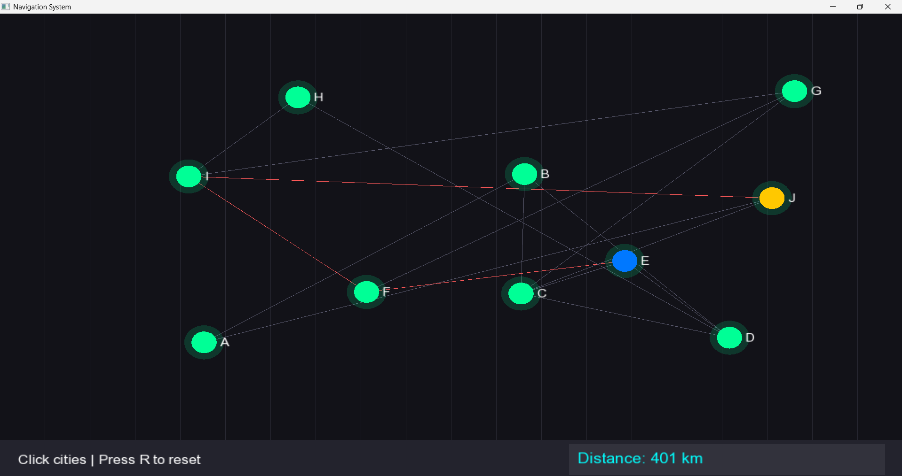
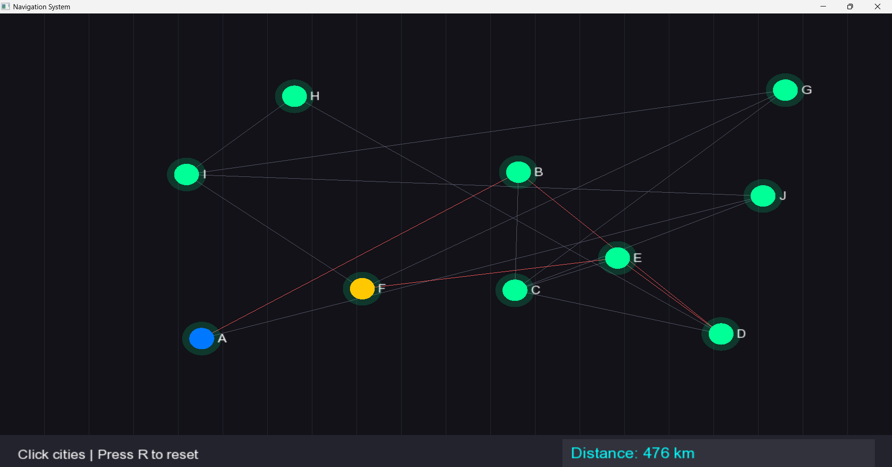
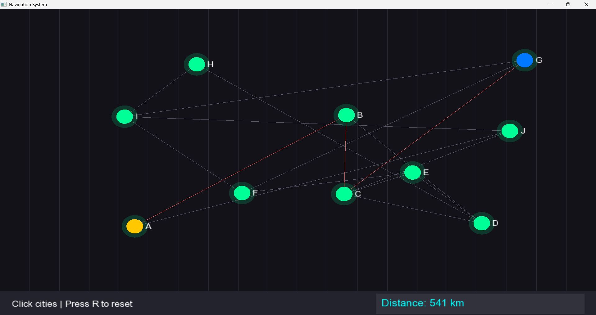

# 🚀 Dijkstra Pathfinding Visualizer (C++ + SFML)

> An interactive navigation system that visually demonstrates how shortest paths are computed using Dijkstra’s Algorithm.

---

## 🧠 Overview

This project simulates a real-world navigation system where users can select source and destination cities, and the system dynamically computes the shortest path.

It combines **graph algorithms with real-time visualization**, making it both an educational and practical demonstration of pathfinding.

---

## 🎯 Features

* Interactive city selection (mouse clicks)
* Real-time shortest path visualization
* Distance calculation display
* Reset functionality for multiple queries
* Graph-based city network

---

## 🖥️ Demo Screenshots





---

## 🛠️ Tech Stack

* C++
* SFML (Simple and Fast Multimedia Library)
* Dijkstra’s Algorithm
* Graph Data Structures

---

## ⚙️ How to Run

### Requirements

* SFML installed
* g++ compiler

### Compile

```bash
g++ main.cpp -o main -lsfml-graphics -lsfml-window -lsfml-system
```

### Run

```bash
./main
```

---

## 🧩 Concepts Demonstrated

* Graph representation
* Priority queue (min-heap)
* Shortest path algorithms
* Event-driven programming (GUI)

---

## 💼 Why This Project Matters

This project demonstrates:

* Strong understanding of **DSA (Dijkstra Algorithm)**
* Ability to build **interactive graphical applications**
* Practical implementation of **real-world navigation systems**

---

## 🚀 Future Improvements

* Integrate real map data (Google Maps / OpenStreetMap)
* Implement A* algorithm for faster routing
* Add animation for path traversal
* Use real GPS coordinates

---

## 👨‍💻 Author

Gautam
